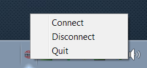

# VPNStatus

A Windows tray icon to start/stop your VPN connection, using Python and Win32 extensions, versus a more involved set of connection procedures. 

## Getting Started

### Prerequisites

* Python 2 or 3
* Python Windows Extensions 
* Configured VPN 

### Installation

1. Setup the VPN per your company’s procedures. Ensure the name of the connection is: <company name> VPN. Enter and save the Username and Password. 

2. Install Python 2.7
http://www.python.org/ftp/python/2.7.3/python-2.7.3.amd64.msi

3. Install (Corresponding) Python for Windows Extensions
http://sourceforge.net/projects/pywin32/files/pywin32/Build%20217/pywin32-217.win-amd64-py2.7.exe/download

4. Change VPNStatus.py internally to &lt; company name &gt;.

5. Double click “VPNStatus.py” to run. 

6. Or create a shortcut, add a registry entry to autorun via pythonw to avoid displaying a console window:  
pythonw VPNStatus.py

## Screenshots

## Contributing

Please read CONTRIBUTING or CONTRIBUTING.md file for details on our code of conduct and the process for submitting pull requests to us.

## Versioning

We use [SemVer](http://semver.org/) for versioning. 

## Authors

* **George Craig** - *Initial work*

## License

MIT License. Please see LICENSE or LICENSE.md file.
